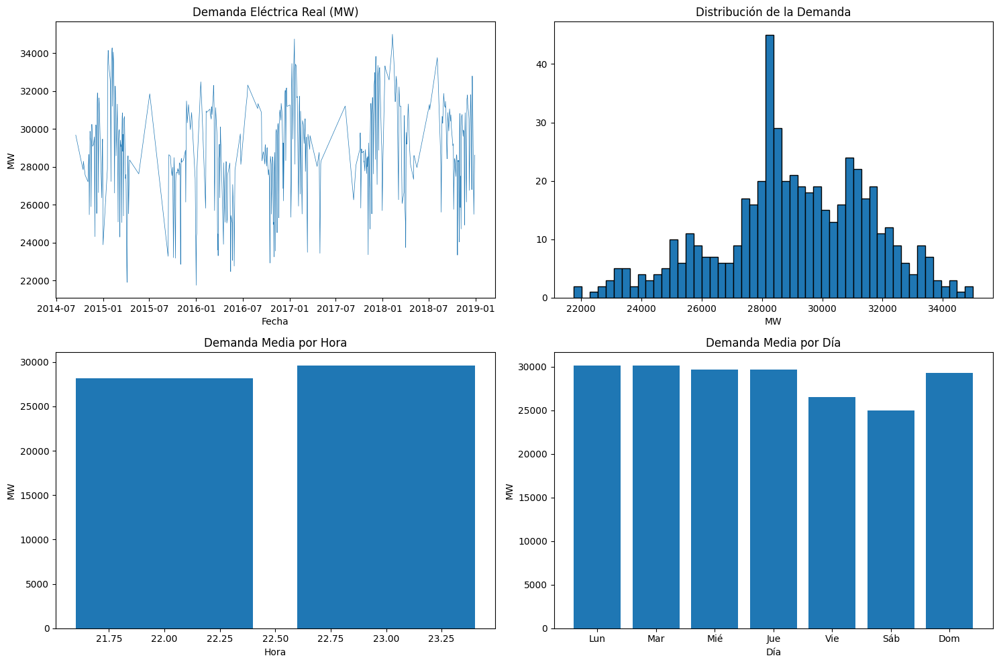

[English](README.md) | **Español**

# EnergiaPredictorES

[](https://www.python.org/)
[](https://pytorch.org/)
[](https://unit8co.github.io/darts/)
[](LICENSE)

**Sistema avanzado de predicción de demanda eléctrica nacional para España**, implementando un pipeline profesional que combina técnicas de **Machine Learning clásico (Gradient Boosting)** con arquitecturas de **Deep Learning de estado del arte (Temporal Fusion Transformer)**.

---

## Tabla de Contenidos

1.  [Descripción del Proyecto](#descripción-del-proyecto)
2.  [Objetivo y Alcance](#objetivo-y-alcance)
3.  [Datos Utilizados](#datos-utilizados)
4.  [Metodología](#metodología)
    *   [Preprocesamiento de Datos](#preprocesamiento-de-datos)
    *   [Ingeniería de Características](#ingeniería-de-características)
    *   [Modelos Implementados](#modelos-implementados)
5.  [Resultados Experimentales](#resultados-experimentales)
    *   [Métricas de Evaluación](#métricas-de-evaluación)
    *   [Comparativa de Modelos](#comparativa-de-modelos)
    *   [Análisis de Resultados](#análisis-de-resultados)
6.  [Instalación y Uso](#instalación-y-uso)
7.  [Estructura del Proyecto](#estructura-del-proyecto)
8.  [Autor](#autor)
9.  [Licencia](#licencia)

---

## Descripción del Proyecto

Este repositorio contiene la implementación completa de un sistema de predicción de demanda eléctrica para el mercado español. El proyecto aborda el problema de la predicción de series temporales de consumo energético, un dominio crítico para la operación eficiente de las redes eléctricas y la planificación de recursos.

Se implementa un enfoque híbrido que combina:
- **Modelos de Gradient Boosting (LightGBM, XGBoost):** Algoritmos de aprendizaje supervisado altamente efectivos para datos tabulares con características ingenierizadas manualmente.
- **Temporal Fusion Transformer (TFT):** Arquitectura de Deep Learning de última generación diseñada específicamente para predicción de series temporales, que combina mecanismos de atención con redes LSTM para capturar dependencias temporales complejas.

El modelo óptimo logra un error porcentual absoluto medio (MAPE) inferior al **1.2%** en el conjunto de test, demostrando la viabilidad del enfoque para aplicaciones en producción.

---

## Objetivo y Alcance

### Objetivo Principal
Desarrollar un modelo predictivo robusto y preciso capaz de pronosticar la **demanda neta de electricidad (MWh)** en el sistema eléctrico español con un horizonte temporal de 24 horas.

### Objetivos Secundarios
- Comparar rigurosamente el rendimiento de modelos de Machine Learning clásico frente a arquitecturas de Deep Learning.
- Demostrar la importancia del **Feature Engineering** temporal en la mejora del rendimiento predictivo.
- Establecer una línea base (**baseline**) con métodos estadísticos simples para cuantificar la mejora de los modelos avanzados.

### Competencias Demostradas
Este proyecto ilustra competencias en:
- **Ingeniería de Características (Feature Engineering):** Diseño de variables sintéticas para capturar patrones estacionales y tendencias.
- **Modelado Predictivo:** Implementación y optimización de múltiples familias de modelos.
- **Evaluación Experimental:** Diseño de experimentos y análisis comparativo con métricas estándar de la industria.
- **MLOps:** Estructura de proyecto modular, reproducible y escalable.

---

## Datos Utilizados

### Fuente de Datos
Los datos provienen del dataset público de Kaggle [Energy Consumption, Generation, Prices and Weather](https://www.kaggle.com/datasets/nicholasjhana/energy-consumption-generation-prices-and-weather), que contiene información histórica del mercado energético español.

### Periodo Temporal
- **Inicio:** 1 de enero de 2014
- **Fin:** 31 de diciembre de 2018
- **Frecuencia:** Depende de la fuente. `spain_energy_market.csv` es diaria; el dataset horario de Kaggle/API REE se mantiene horario.

### Variables Principales
| Variable | Descripción |
|----------|-------------|
| `total load actual` | Demanda real de electricidad (MWh) - **Variable objetivo** |
| `generation_solar` | Generación solar (MWh) |
| `generation_wind_onshore` | Generación eólica terrestre (MWh) |
| `generation_nuclear` | Generación nuclear (MWh) |
| `temp`, `humidity`, `pressure`, `wind_speed` | Variables meteorológicas |

### Partición de Datos
Para respetar la naturaleza temporal del problema y evitar **data leakage**, el pipeline utiliza una partición cronológica estricta. Los tamaños exactos dependen de la fuente y se calculan después de regularizar la frecuencia, sin interpolar el objetivo.

---

---

## Análisis Exploratorio de Datos (EDA)

Antes de modelar, realizamos un análisis exhaustivo del comportamiento de la demanda eléctrica:


*Figura 1: Descomposición de la demanda eléctrica: serie temporal, distribución y patrones promedio por hora y día.*

---

## Metodología

### Preprocesamiento de Datos

El pipeline de preprocesamiento (`src/data/`) realiza las siguientes operaciones:

1.  **Limpieza de Timestamps:** Normalización de fechas para manejar correctamente los cambios de horario de verano/invierno en España.
2.  **Tratamiento de Valores Nulos:** Forward-fill únicamente para covariables; los valores faltantes del objetivo no se interpolan.
3.  **Detección de Anomalías:** Identificación y filtrado de outliers mediante análisis estadístico de Z-score.
4.  **Escalado de Características:** Normalización StandardScaler para los modelos de Deep Learning.

### Ingeniería de Características

Se diseñaron variables sintéticas para capturar los distintos patrones de consumo eléctrico:

#### Características Temporales (Cíclicas)
Para capturar la naturaleza cíclica del tiempo, se aplicó codificación trigonométrica:
```
hour_sin = sin(2 * pi * hour / 24)
hour_cos = cos(2 * pi * hour / 24)
day_sin  = sin(2 * pi * day_of_week / 7)
day_cos  = cos(2 * pi * day_of_week / 7)
month_sin = sin(2 * pi * month / 12)
month_cos = cos(2 * pi * month / 12)
```
Este enfoque evita la discontinuidad artificial entre, por ejemplo, las 23:00 y las 00:00.

#### Características de Calendario
- `is_weekend`: Indicador binario para sábados y domingos.
- `is_holiday`: Detección automática de festivos nacionales y regionales utilizando la librería `holidays`.

#### Características de Rezago (Lag Features)
Se incluyeron valores históricos de la variable objetivo:
- `load_lag_1step`: Demanda de la observación anterior.
- `load_lag_1day`: Demanda del día anterior.
- `load_lag_1week`: Demanda de la semana anterior.

#### Estadísticas de Ventana Móvil
- Media y desviación estándar de la demanda en ventanas de 6, 12 y 24 horas.

### Modelos Implementados

#### 1. Modelos Baseline (Referencia)

Se implementaron dos baselines estadísticos simples para establecer un límite inferior de rendimiento aceptable:

- **Naive (día anterior):** Predicción basada en el valor observado el día anterior.
- **Seasonal Naive (semana anterior):** Predicción basada en el valor observado la semana anterior.

#### 2. Modelos de Gradient Boosting

**LightGBM:**
- Algoritmo de boosting basado en gradiente desarrollado por Microsoft.
- Utiliza histogramas para acelerar el entrenamiento.
- Hiperparámetros: `n_estimators=100`, `max_depth=6`, `learning_rate=0.1`

**XGBoost:**
- Implementación altamente optimizada de Gradient Boosting.
- Hiperparámetros: `n_estimators=100`, `max_depth=6`, `learning_rate=0.1`

#### 3. Temporal Fusion Transformer (TFT)

Arquitectura de Deep Learning desarrollada por Google Research, específicamente diseñada para predicción de series temporales multihorzionte con interpretabilidad.

**Características clave:**
- **Multi-Horizon Forecasting:** Predice múltiples pasos futuros simultáneamente.
- **Variable Selection Networks:** Selecciona automáticamente las características más relevantes.
- **Interpretable Multi-Head Attention:** Identifica las dependencias temporales más importantes.

**Configuración del modelo:**
```python
TFTModel(
    input_chunk_length=30,    # Ventana de entrada: 30 días
    output_chunk_length=7,    # Horizonte de predicción: 7 días
    hidden_size=32,
    lstm_layers=1,
    num_attention_heads=4,
    dropout=0.1,
    batch_size=32,
    n_epochs=20,
    optimizer_kwargs={'lr': 1e-3}
)
```
**Parámetros totales:** 73,000 (entrenados en GPU Tesla T4)

---

## Resultados Experimentales

### Métricas de Evaluación

Se utilizaron cuatro métricas estándar para evaluar el rendimiento de los modelos:

| Métrica | Fórmula | Interpretación |
|---------|---------|----------------|
| **MAE** | Mean Absolute Error | Error promedio en unidades originales (MWh) |
| **RMSE** | Root Mean Squared Error | Penaliza más los errores grandes |
| **MAPE** | Mean Absolute Percentage Error | Error porcentual promedio (%) |
| **sMAPE** | Symmetric MAPE | Versión simétrica del MAPE |

### Comparativa de Modelos

Los resultados anteriores se han retirado: la ejecución original incluía
features derivadas del objetivo actual (`diff`/`ratio`) y no constituía una
evaluación válida. Hay que volver a ejecutar el pipeline corregido para
generar una tabla de métricas limpia.

La figura anterior se conserva como histórico, pero no debe utilizarse como
resultado válido hasta regenerarla con el pipeline corregido.

### Estado de la evaluación

Las métricas deben compararse solo cuando todos los modelos usan la misma
frecuencia, horizonte, partición temporal y conjunto de features disponibles
en el instante de predicción.

### Conclusión

La implementación corregida es la referencia para comparar modelos. No se debe
afirmar qué arquitectura es mejor hasta volver a ejecutar la evaluación sobre
la fuente, frecuencia, horizonte y partición elegidos.

---

## Instalación y Uso

### Prerrequisitos
- Python 3.9 o superior
- Git

### Setup del Entorno

1.  Clonar el repositorio:
    ```bash
    git clone https://github.com/nathanmarinas2/EnergiaPredictorES.git
    cd EnergiaPredictorES
    ```

2.  Crear y activar entorno virtual:
    ```bash
    python -m venv venv
    source venv/bin/activate  # Linux/macOS
    venv\Scripts\activate     # Windows
    ```

3.  Instalar dependencias:
    ```bash
    pip install -r requirements.txt
    ```

### Ejecución del Pipeline

#### Opción A: Notebook Interactivo (Recomendado)
Abrir `notebooks/EnergiaPredictorES_Colab.ipynb` en Google Colab o Jupyter local para ver el proceso completo con visualizaciones.

#### Opción B: Scripts de Python
```bash
# 1. Descargar datos (requiere credenciales de Kaggle)
python src/data/download.py

# 2. Preprocesar datos
python src/data/preprocessing.py

# 3. Entrenar modelos
python src/models/baseline.py --model lightgbm
```

---

## Estructura del Proyecto

```
EnergiaPredictorES/
|-- config.yaml             # Configuración global (rutas, hiperparámetros)
|-- requirements.txt        # Dependencias de Python
|-- pyproject.toml          # Configuración de proyecto moderna
|-- LICENSE                 # Licencia MIT
|-- README.es.md            # Documentación en Español
|-- README.md               # English Documentation
|
|-- data/
|   |-- raw/                # Datos originales (inmutables)
|   +-- processed/          # Datos transformados para modelado
|
|-- notebooks/
|   +-- EnergiaPredictorES_Colab.ipynb  # Notebook principal con EDA y modelado
|
|-- src/
|   |-- data/
|   |   |-- download.py         # Descarga de datos desde Kaggle
|   |   |-- download_ree.py     # Descarga alternativa desde API REE
|   |   +-- preprocessing.py    # Pipeline de preprocesamiento
|   |
|   |-- models/
|   |   |-- baseline.py         # Implementación de LightGBM, XGBoost
|   |   +-- tft.py              # Implementación del Temporal Fusion Transformer
|   |
|   +-- evaluation/
|       +-- metrics.py          # Funciones de evaluación (MAPE, RMSE, etc.)
|
+-- models/                 # Modelos entrenados (no versionados)
```

---

## Autor

**Nathan Mariñas Pose**

- Ingeniería en Inteligencia Artificial - Universidad de A Coruña
- [LinkedIn](https://www.linkedin.com/in/nathan-mari%C3%B1as-pose-419b0b385/)

---

## Licencia

Este proyecto está bajo la Licencia MIT. Consultar el archivo [LICENSE](LICENSE) para más detalles.
