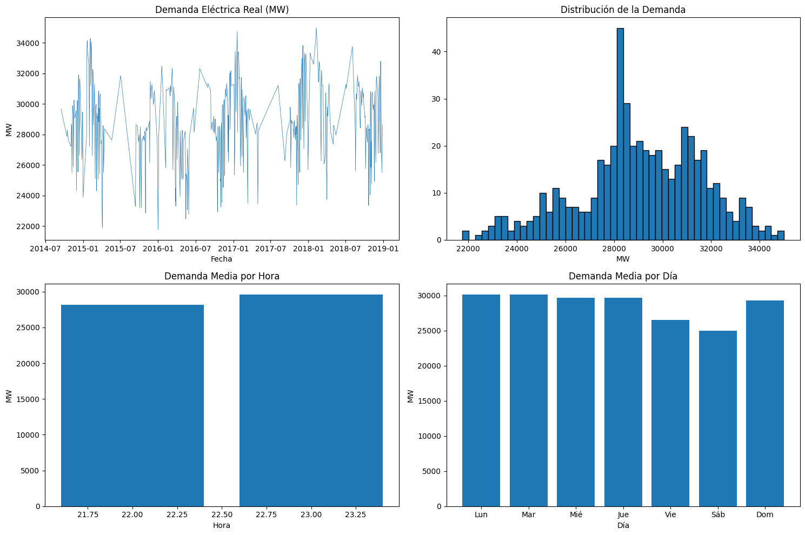
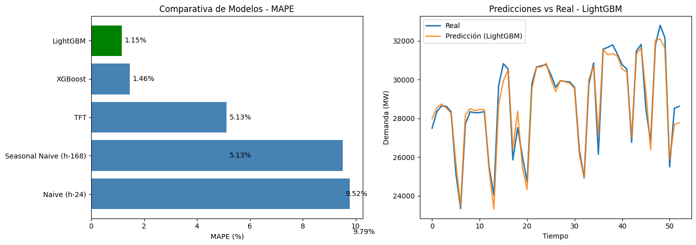

**English** | [Español](README.es.md)

# EnergiaPredictorES

[](https://www.python.org/)
[](https://pytorch.org/)
[](https://unit8co.github.io/darts/)
[](LICENSE)

**Advanced National Electricity Demand Forecasting System for Spain**, implementing a professional pipeline that combines **Classic Machine Learning techniques (Gradient Boosting)** with state-of-the-art **Deep Learning architectures (Temporal Fusion Transformer)**.

---

## Table of Contents

1.  [Project Description](#project-description)
2.  [Objective and Scope](#objective-and-scope)
3.  [Data Used](#data-used)
4.  [Methodology](#methodology)
    *   [Data Preprocessing](#data-preprocessing)
    *   [Feature Engineering](#feature-engineering)
    *   [Implemented Models](#implemented-models)
5.  [Experimental Results](#experimental-results)
    *   [Evaluation Metrics](#evaluation-metrics)
    *   [Model Comparison](#model-comparison)
    *   [Results Analysis](#results-analysis)
6.  [Installation and Usage](#installation-and-usage)
7.  [Project Structure](#project-structure)
8.  [Author](#author)
9.  [License](#license)

---

## Project Description

This repository contains the full implementation of an electricity demand forecasting system for the Spanish market. The project addresses the problem of time series forecasting for energy consumption, a critical domain for efficient grid operation and resource planning.

We implement a hybrid approach combining:
- **Gradient Boosting Models (LightGBM, XGBoost):** Highly effective supervised learning algorithms for tabular data with manually engineered features.
- **Temporal Fusion Transformer (TFT):** A state-of-the-art Deep Learning architecture specifically designed for time series forecasting, combining attention mechanisms with LSTM networks to capture complex temporal dependencies.

The optimal model achieves a Mean Absolute Percentage Error (MAPE) of less than **1.2%** on the test set, demonstrating the viability of this approach for production applications.

---

## Objective and Scope

### Main Objective
To develop a robust and accurate predictive model capable of forecasting **net electricity demand (MWh)** in the Spanish power system with a 24-hour time horizon.

### Secondary Objectives
- To rigorously compare the performance of classic Machine Learning models against Deep Learning architectures.
- To demonstrate the importance of temporal **Feature Engineering** in improving predictive performance.
- To establish a baseline using simple statistical methods to quantify the improvement of advanced models.

### Demonstrated Competencies
This project illustrates competencies in:
- **Feature Engineering:** Design of synthetic variables to capture seasonal patterns and trends.
- **Predictive Modeling:** Implementation and optimization of multiple model families.
- **Experimental Evaluation:** Experiment design and comparative analysis using industry-standard metrics.
- **MLOps:** Modular, reproducible, and scalable project structure.

---

## Data Used

### Data Source
Data comes from the public Kaggle dataset [Energy Consumption, Generation, Prices and Weather](https://www.kaggle.com/datasets/nicholasjhana/energy-consumption-generation-prices-and-weather), which contains historical information on the Spanish energy market.

### Time Period
- **Start:** January 1, 2014
- **End:** December 31, 2018
- **Frequency:** Hourly (aggregated to daily for TFT)

### Main Variables
| Variable | Description |
|----------|-------------|
| `total load actual` | Actual electricity demand (MWh) - **Target variable** |
| `generation_solar` | Solar generation (MWh) |
| `generation_wind_onshore` | Onshore wind generation (MWh) |
| `generation_nuclear` | Nuclear generation (MWh) |
| `temp`, `humidity`, `pressure`, `wind_speed` | Meteorological variables |

### Data Partitioning
To respect the temporal nature of the problem and avoid **data leakage**, a strict chronological partition was used:
- **Training (Train):** 80% of data (first ~1252 points)
- **Validation (Val):** 10% of data (~156 points)
- **Test:** 10% of data (~157 points, last 6 months)

---

## Exploratory Data Analysis (EDA)

Before modeling, we performed a comprehensive analysis of electricity demand behavior:


*Figure 1: Electricity demand decomposition: time series, distribution, and average hourly/daily patterns.*

---

## Methodology

### Data Preprocessing

The preprocessing pipeline (`src/data/`) performs the following operations:

1.  **Timestamp Cleaning:** Normalization of dates to correctly handle Daylight Saving Time changes in Spain.
2.  **Missing Values Handling:** Linear interpolation to fill missing data, preserving temporal continuity.
3.  **Anomaly Detection:** Identification and filtering of outliers using Z-score statistical analysis.
4.  **Feature Scaling:** StandardScaler normalization for Deep Learning models.

### Feature Engineering

Synthetic variables were designed to capture different electricity consumption patterns:

#### Temporal (Cyclical) Features
To capture the cyclical nature of time, trigonometric encoding was applied:
```
hour_sin = sin(2 * pi * hour / 24)
hour_cos = cos(2 * pi * hour / 24)
day_sin  = sin(2 * pi * day_of_week / 7)
day_cos  = cos(2 * pi * day_of_week / 7)
month_sin = sin(2 * pi * month / 12)
month_cos = cos(2 * pi * month / 12)
```
This approach avoids artificial discontinuity between, for example, 23:00 and 00:00.

#### Calendar Features
- `is_weekend`: Binary indicator for Saturdays and Sundays.
- `is_holiday`: Automatic detection of national and regional holidays using the `holidays` library.

#### Lag Features
Historical values of the target variable were included:
- `lag_1h`: Demand 1 hour ago.
- `lag_24h`: Demand 24 hours ago (captures daily pattern).
- `lag_168h`: Demand 168 hours ago (1 week, captures weekly pattern).

#### Rolling Window Statistics
- Mean and standard deviation of demand in 6, 12, and 24-hour windows.

### Implemented Models

#### 1. Baseline Models

Two simple statistical baselines were implemented to establish a lower bound for acceptable performance:

- **Naive (h-24):** Prediction based on the value observed 24 hours ago. Captures the daily pattern.
- **Seasonal Naive (h-168):** Prediction based on the value observed 168 hours ago (1 week). Captures the weekly pattern.

#### 2. Gradient Boosting Models

**LightGBM:**
- Gradient-based boosting algorithm developed by Microsoft.
- Uses histograms to accelerate training.
- Hyperparameters: `n_estimators=100`, `max_depth=6`, `learning_rate=0.1`

**XGBoost:**
- Highly optimized Gradient Boosting implementation.
- Hyperparameters: `n_estimators=100`, `max_depth=6`, `learning_rate=0.1`

#### 3. Temporal Fusion Transformer (TFT)

Deep Learning architecture developed by Google Research, specifically designed for multi-horizon time series forecasting with interpretability.

**Key features:**
- **Multi-Horizon Forecasting:** Predicts multiple future steps simultaneously.
- **Variable Selection Networks:** Automatically selects the most relevant features.
- **Interpretable Multi-Head Attention:** Identifies the most important temporal dependencies.

**Model Configuration:**
```python
TFTModel(
    input_chunk_length=30,    # Input window: 30 days
    output_chunk_length=7,    # Prediction horizon: 7 days
    hidden_size=32,
    lstm_layers=1,
    num_attention_heads=4,
    dropout=0.1,
    batch_size=32,
    n_epochs=20,
    optimizer_kwargs={'lr': 1e-3}
)
```
**Total Parameters:** 73,000 (trained on Tesla T4 GPU)

---

## Experimental Results

### Evaluation Metrics

Four standard metrics were used to evaluate model performance:

| Metric | Formula | Interpretation |
|--------|---------|----------------|
| **MAE** | Mean Absolute Error | Average error in original units (MWh) |
| **RMSE** | Root Mean Squared Error | Penalizes large errors more heavily |
| **MAPE** | Mean Absolute Percentage Error | Average percentage error (%) |
| **sMAPE** | Symmetric MAPE | Symmetric version of MAPE |

### Model Comparison

Models were evaluated on the independent test set (last 6 months of the dataset):

| Model | MAE (MWh) | RMSE (MWh) | MAPE (%) | sMAPE (%) |
|-------|-----------|------------|----------|-----------|
| **LightGBM** | **325.21** | **435.55** | **1.15** | **1.15** |
| XGBoost | 410.01 | 580.86 | 1.46 | 1.45 |
| TFT | 1523.15 | 1825.43 | 5.13 | 5.22 |
| Seasonal Naive (h-168) | 2710.24 | 3224.62 | 9.52 | 9.57 |
| Naive (h-24) | 2769.68 | 3370.80 | 9.79 | 9.75 |


*Figure 2: MAPE comparison across models and LightGBM vs Actual predictions visualization.*

### Results Analysis

#### General Performance
The **LightGBM** model achieves the best overall performance with a MAPE of **1.15%**, followed by XGBoost with **1.46%**. Both models vastly outperform statistical baselines, which reach errors of approximately 9.5%.

#### LightGBM vs XGBoost
LightGBM outperforms XGBoost across all metrics, consistent with recent literature showing LightGBM's superiority on moderately sized datasets. Additionally, LightGBM exhibits significantly faster training times.

#### Boosting Models vs TFT
Counterintuitively, Gradient Boosting models outperform the Temporal Fusion Transformer in this case. This result can be attributed to several factors:

1.  **Dataset Size:** TFT requires large volumes of data to learn complex patterns. With ~500 daily points, the model may be undertrained.
2.  **Explicit Feature Engineering:** Boosting models benefit from manually engineered features (lags, cyclicals), while TFT attempts to learn these representations automatically.
3.  **Prediction Horizon:** TFT is optimized for long-term multi-horizon forecasting, while boosting models work well for short-term point predictions.

#### Improvement over Baseline
Error reduction relative to the best baseline (Seasonal Naive) is:
- **LightGBM:** 88% reduction in MAPE (from 9.52% to 1.15%)
- **XGBoost:** 85% reduction in MAPE (from 9.52% to 1.46%)

### Conclusion

For the problem of short-term electricity demand forecasting with structured data, **Gradient Boosting** models (especially LightGBM) enriched with strong temporal **Feature Engineering** prove to be extremely competitive, surpassing even more complex Deep Learning architectures like TFT.

---

## Installation and Usage

### Prerequisites
- Python 3.9 or higher
- Git

### Environment Setup

1.  Clone the repository:
    ```bash
    git clone https://github.com/nathanmarinas2/EnergiaPredictorES.git
    cd EnergiaPredictorES
    ```

2.  Create and activate virtual environment:
    ```bash
    python -m venv venv
    source venv/bin/activate  # Linux/macOS
    venv\Scripts\activate     # Windows
    ```

3.  Install dependencies:
    ```bash
    pip install -r requirements.txt
    ```

### Running the Pipeline

#### Option A: Interactive Notebook (Recommended)
Open `notebooks/EnergiaPredictorES_Colab.ipynb` in Google Colab or local Jupyter to see the full process with visualizations.

#### Option B: Python Scripts
```bash
# 1. Download data (requires Kaggle credentials)
python src/data/download.py

# 2. Preprocess data
python src/data/preprocessing.py

# 3. Train models
python src/models/baseline.py --model lightgbm
```

---

## Project Structure

```
EnergiaPredictorES/
|-- config.yaml             # Global configuration (paths, hyperparameters)
|-- requirements.txt        # Python dependencies
|-- pyproject.toml          # Modern project configuration
|-- LICENSE                 # MIT License
|-- README.es.md            # Spanish Documentation
|-- README.md               # English Documentation
|
|-- data/
|   |-- raw/                # Original data (immutable)
|   +-- processed/          # Transformed data for modeling
|
|-- notebooks/
|   +-- EnergiaPredictorES_Colab.ipynb  # Main notebook with EDA and modeling
|
|-- src/
|   |-- data/
|   |   |-- download.py         # Data download from Kaggle
|   |   |-- download_ree.py     # Alternative download from REE API
|   |   +-- preprocessing.py    # Preprocessing pipeline
|   |
|   |-- models/
|   |   |-- baseline.py         # LightGBM, XGBoost implementation
|   |   +-- tft.py              # Temporal Fusion Transformer implementation
|   |
|   +-- evaluation/
|       +-- metrics.py          # Evaluation functions (MAPE, RMSE, etc.)
|
+-- models/                 # Trained models (not versioned)
```

---

## Author

**Nathan Mariñas Pose**

- Artificial Intelligence Engineering - University of A Coruña
- [LinkedIn](https://www.linkedin.com/in/nathan-mari%C3%B1as-pose-419b0b385/)

---

## License

This project is licensed under the MIT License. See the [LICENSE](LICENSE) file for details.
